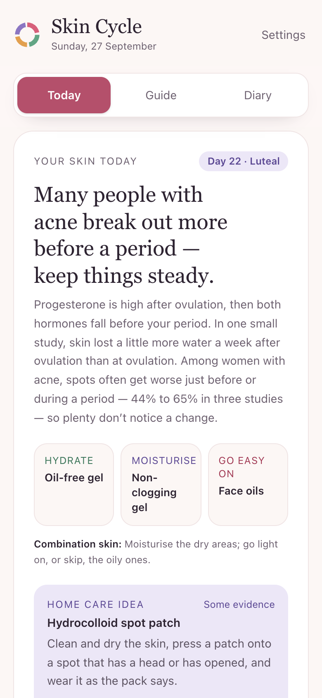
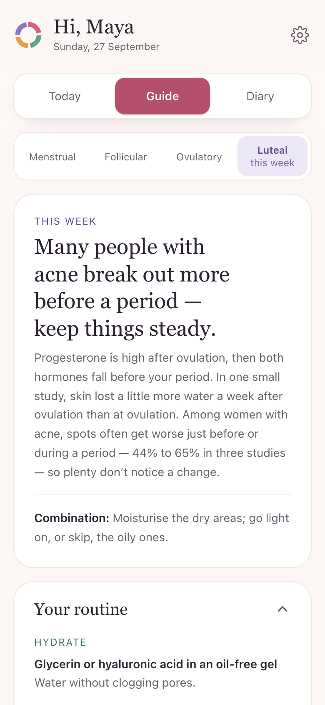
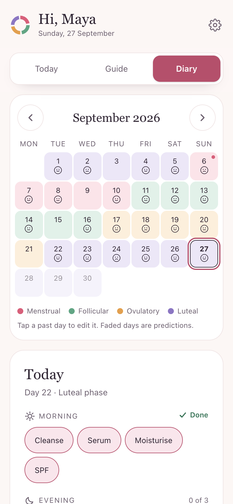

# Skin Cycle

Skincare that follows your cycle — a private skin diary with tips for each phase of your cycle,
checked against 67 sources.

**[Live site](https://shonalikrishnani-git.github.io/skin-cycle/)** ·
**[Demo](https://shonalikrishnani-git.github.io/skin-cycle/app/?tour)** ·
**[Case study](https://shonalikrishnani-git.github.io/skin-cycle/about.html)** ·
**[Rapid review](https://shonalikrishnani-git.github.io/skin-cycle/research.html)** (AI-assisted, 47 studies)

[](https://doi.org/10.5281/zenodo.23024631)

A portfolio project by **Sonali Krishnani** (M.Sc. Microbiology, Biology teacher), built with
**Claude Code**, an AI coding assistant.

| Today | Guide | Diary |
|---|---|---|
|  |  |  |

## What it does

- **Start** — name, date of birth (for your age), skin type, cycle and routine, in four short steps.
- **Today** — tips for your current phase, matched to your skin type, plus a two-tap diary:
  tick your routine steps and rate your skin.
- **Guide** — each phase's routine, home care with an evidence level and a caution on every remedy,
  myths, when to see a GP, and 67 sources.
- **Diary** — a calendar coloured by cycle phase, and your own skin pattern once there's enough data.
- **Your routine** — pick suggested steps or type your own, in your order.
- **Demo** — a guided five-step walk-through of a sample diary. Nothing is saved.

No account, no server: everything stays in your browser.

## My role

- Product idea and direction: skin first, the cycle as context — not a period tracker.
- The rules the advice must follow: ingredient types, not brands; no "toxic" scores; no scraped
  reviews; a caution on every remedy; no health claim without a checked source.
- Led three rounds of fact-checking and made every call on what to cut and keep.

Claude Code wrote the code, ran the research and review agents, and applied their findings.

## How the advice was checked

Every claim was treated as wrong until an opened source backed it (AAD, NHS, HSE, DermNet, FDA,
PubMed). That cut honey and aloe vera, replaced ice on a deep spot with the AAD's warm-compress
advice, corrected a pregnancy note and an under-urgent warning sign, and moved "ovulation glow" to
the myths list. The app says plainly that research on skin across the cycle is thin.

Automated tests fail if a remedy loses its caution, a source goes unused, or a published count
drifts from the data. The rules for adding guidance are at the top of `src/lib/skin.ts`.

## Run it

```bash
npm install
npm run dev     # the app at http://localhost:5180
npm test        # cycle maths, content checks, routine and storage
npm run build   # typecheck, build the app into dist/app, copy the landing pages into dist/
```

Needs Node 23.6+. Deployed to GitHub Pages from `main` by `.github/workflows/pages.yml`.
`node scripts/screenshots.mjs` (with the dev server running and Google Chrome installed)
retakes the landing page screenshots and link-preview image.

## How it's built

React 19, strict TypeScript, Vite, Tailwind 4 — nothing else.

```
src/lib/        skin.ts (the guidance and sources) · cycle.ts (phase maths) · log.ts (diary, routine)
                storage.ts (localStorage, validated on load) · brand.ts (the app name)
src/components/ Onboarding · Settings · RoutineEditor · Tour (the demo) · SkinToday · CheckIn · Guide
                Sources · Calendar · Pattern · CycleCard
site/           the one-page landing (index.html, landing.css, landing.js), case study and rapid review
research/       the AI-assisted rapid review: protocol, search log, screening and extraction data, GRADE summary
tests/          cycle, content, and routine/storage tests
```

## Verified 27 Sep 2026

Landing page on desktop and at 375px · four-step setup with name and date of birth (age shown,
under-13s stopped) · your own routine steps · the five-step demo saves nothing · Guide sections
fold open and closed · 10 don't-try items and 67 sources render · no text under 12px, muted text
passes WCAG AA · animations switch off with reduced motion · `npm test` and `npm run build` pass.

## Limits

- Not yet reviewed by a pharmacist or dermatologist — the checks were done by AI agents.
- General skincare information, not medical advice or contraception.
- Phases are estimates from the dates you log.
- One browser on one device; clearing site data erases the diary.

## Cite

Krishnani, S. (2026). *Skin Cycle: a skincare diary app and an AI-assisted rapid review of skin across the menstrual cycle* [Software]. Zenodo. https://doi.org/10.5281/zenodo.23024631
